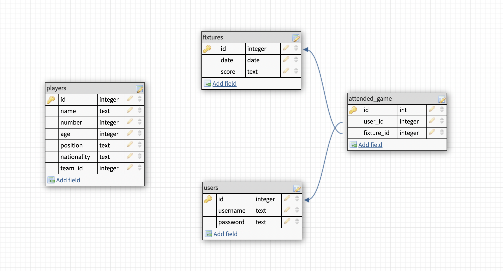
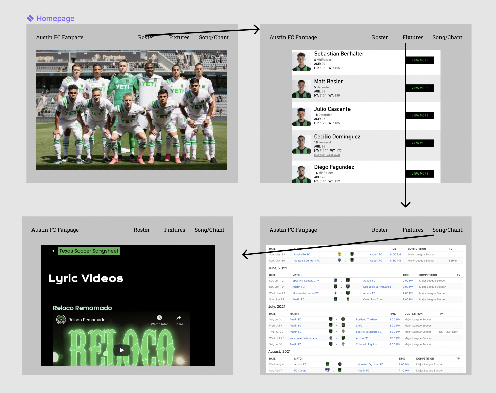

# Austin FC Fan App

## Overview

The purpose of this app is to allow users to follow Austin FC by geting detailed information about the team, results, fixtures, etc.
## ERD and Wireframes

 

## User Stories

- I can view the team's logo and images on the homepage.
- When I click onto the roster page, I can find information and pictures about each player.
- When I click on the fixture link in the nav bar, I can see the team's previous results, and upcoming matches.
- When I navigate to the song and chant page, I will see lyrics and videos of the songs
- When I login, I can see all of the games I have attended
- When I am logged in, I can go to the fixtures page, and mark that I have attended a specific game.

## Routes Inventory

| Verb |        Path        |            Summary            |   |   |
|:----:|:------------------:|:-----------------------------:|---|---|
|  GET |       /roster      |       load entire roster      |   |   |
|  GET | /roster/player/:id |    get specific player info   |   |   |
| POST |       /roster      |       save roster to db       |   |   |
| POST |      /fixtures     |      save fixtures to db      |   |   |
|  GET |   /user/fixtures   | get fixtures linked with user |   |   |
| POST | /user/fixtures/:id | save fixtures to user profile |   |   |
## MVP Checklist

- Roster page with player details and images
- Fixture page with up to date results
- User account functionality
- Users can collect games they've attended to their profile
- Song and chant lyrics and lyric videos embedded

## Stretch Goals

- League Standings
- Users can add photos to fixtures
- Forum/discussion page
- Team Statistics
- Player Statistics
